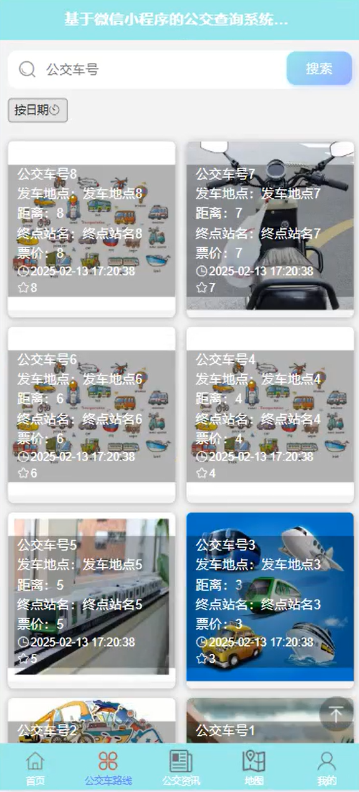
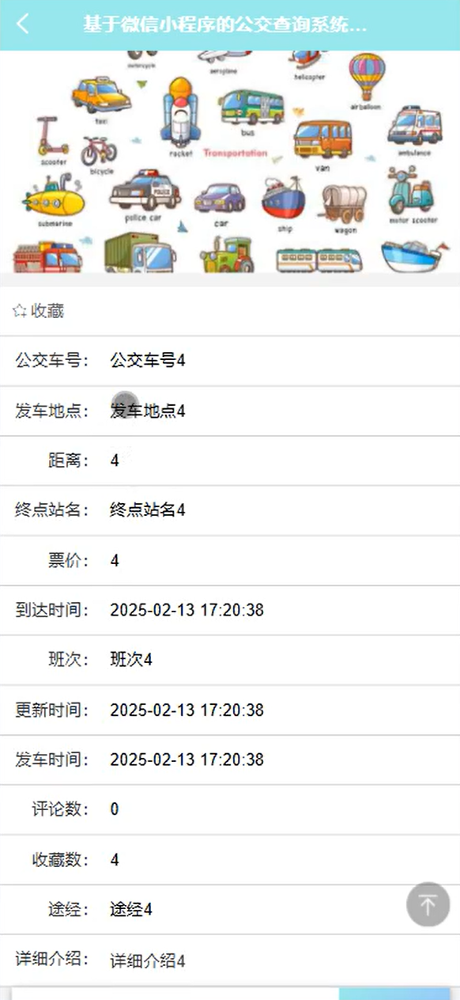
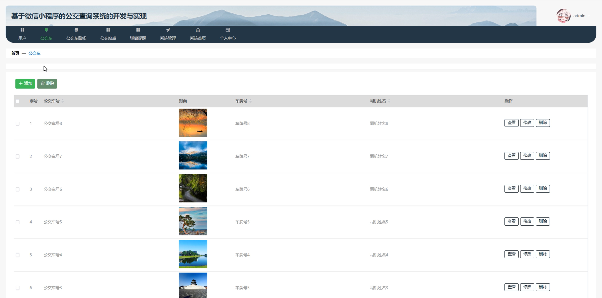
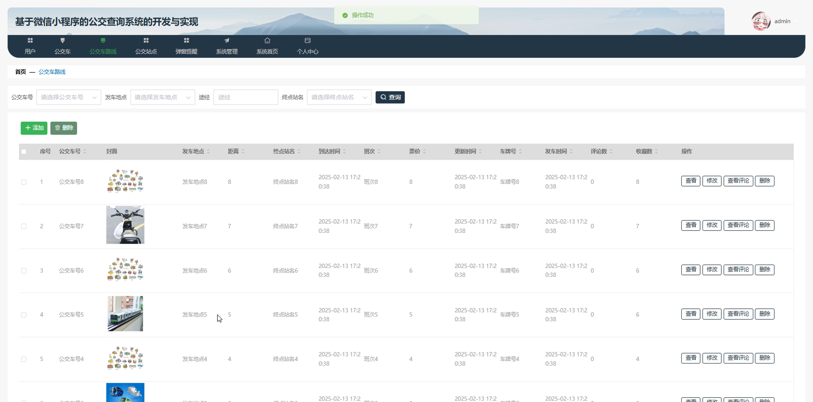
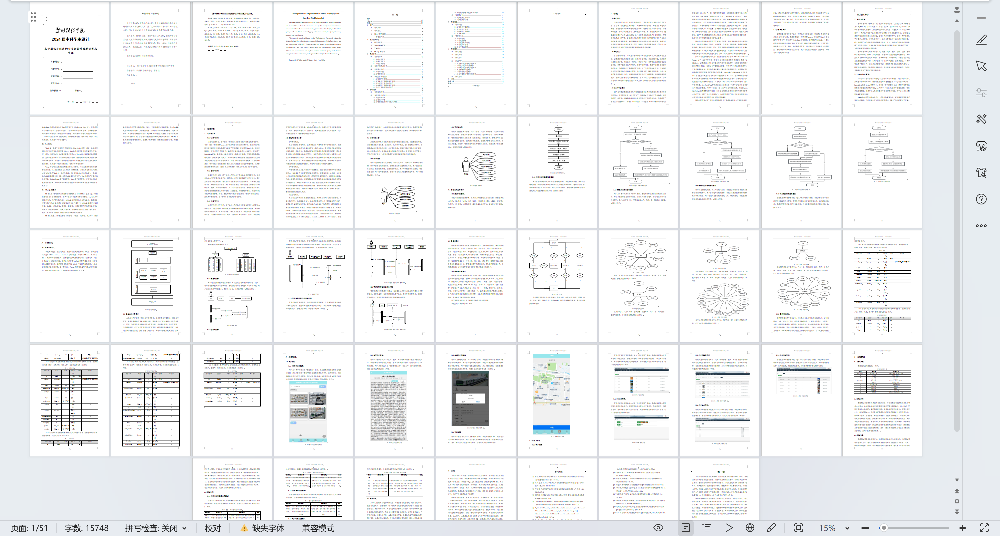

# mpweixinA226D
mpweixinA226D公交查询微信小程序+LW+PPT
 
## 源码问题查看主页咨询

### 一、关键词
公交车路线，公交弹窗提醒，公交站点

### 二、作品包含
源码+数据库+万字设计文档+PPT+全套环境和工具资源+本地部署教程

### 三、项目技术
前端技术： Html、Css、Js、Vue2.0、Element-ui、uniapp
后端技术：Java、SpringBoot2.0、MyBatis

### 四、运行环境（以下版本亲测，其他版本兼容性请自行测试）
开发工具：IDEA/eclipse  + VSCODE + 微信开发者工具 + HBuilder X

数据库：MySQL5.7（最低要5.7版本）

数据库管理工具：Navicat10以上版本

环境配置软件： JDK1.8 + Maven3.6.3

前端Nodejs：14

浏览器：谷歌浏览器

### 五、项目介绍
项目编号：mpweixinA226

基于微信小程序的公交查询系统可让用户便捷查询公交实时位置、线路规划、到站时间等信息，提升公交出行效率与体验。

角色：管理员、用户

用户功能：首页、公交车路线、公告资讯、地图、我的、我的收藏、修改密码。

管理员功能：用户、公交车、公交车路线、公交站点、弹窗提醒、系统管理、系统首页、个人中心。

### 六、运行截图

